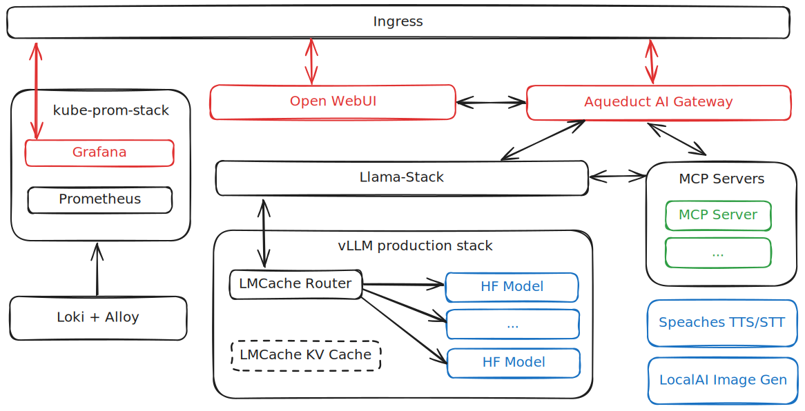

# tuw-ai-stack - Helm Charts for the AI stack at TU Wien

## 🚀 Helm Charts

What is being deployed?
- **aqueduct** - AI gateway (helm chart can be found at [https://github.com/TU-Wien-dataLAB/aqueduct/tree/main/charts/aqueduct](https://github.com/TU-Wien-dataLAB/aqueduct/tree/main/charts/aqueduct))
- **vllm-production-stack** - inference engine with model router (helm chart found at [https://github.com/vllm-project/production-stack](https://github.com/vllm-project/production-stack))
- **cert-issuer** - certificate issuer for TLS certificates
- **kube-prometheus-stack** - monitoring and observability stack with Prometheus, Grafana, and AlertManager
- **llama-stack** - unified OpenAI-compatible API layer
- **loki** - log aggregation system with Alloy
- **mcp-servers** - Model Context Protocol servers for AI/ML workloads
- **open-webui** - LLM chat interface
- **speaches** - speech-to-text service
- **local-ai** - image generation (helm chart can be found at [https://github.com/go-skynet/helm-charts/tree/main/charts/local-ai](https://github.com/go-skynet/helm-charts/tree/main/charts/local-ai))

Cluster Dependencies:
- External Secrets Operator
- Ingress Controller (ingress-nginx)
- cert-manager
- CSI Storage Driver with dynamic provisioning
- Default StorageClass
- Vault (or other secret backend for External Secrets)
- OIDC Provider (for SSO integrations)
- CNI with NetworkPolicy support
- NVIDIA GPU Operator

---

## Architecture Overview



The architecture diagram above provides a visual overview of the deployed services.
It uses color coding to distinguish different service categories:

**Red boxes** indicate services that are externally exposed through the ingress controller,
including Aqueduct (AI gateway), Open WebUI (LLM chat interface), and Grafana (monitoring dashboard).

**Blue boxes** represent AI model services, encompassing text generation, image generation, and text-to-speech/speech-to-text capabilities.
The LMCache router aggregates models deployed in the vLLM production stack to provide a single access point.
Note that the Speaches and LocalAI models are also directly connected to Aqueduct, but due to space constraints the arrows were omitted.

**Green boxes** show the Model Context Protocol (MCP) servers.
Notably, Llama Stack directly accesses MCP servers because of the OpenAI Responses API,
while Aqueduct exposes MCP servers directly to application developers.


---

## 🐳 Llama Stack Docker Distribution

This repository includes a custom **tuw-ai** distribution of [Llama Stack](https://github.com/llamastack/llama-stack).

### Quick Start

```bash
# Pull the pre-built image
docker pull ghcr.io/tu-wien-datalab/llama-stack:main

# Run the tuw-ai distribution
docker run -p 8321:8321 ghcr.io/tu-wien-datalab/llama-stack:main llama stack run tuw-ai --port 8321
```

### Build Locally

```bash
cd utils/llama-stack-distribution
docker build -f Dockerfile --tag llama-stack:tuw-ai .
docker run -p 8321:8321 llama-stack:tuw-ai llama stack run tuw-ai --port 8321
```
